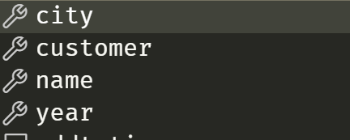

## so..what is json?

Im assuming you are here to learn about json schemas, but just to make sure we are on the same page, let me quickly explain json:

Json is a way of structuring data through text, that you want to either store or send between services; server->server, server->website, website->end user etc..

!!! info Json types
	the different types you can store in a json is:
	- string
	- number/double
	- boolean
	- array/list
	- object/map
	- null

The nice thing about json is that its both (mostly) human and computer readable.

```json
{
	"text":"this is some text",
	"number":42.23,
	"boolean":true,
	"array":[
		"array is also called 'list' in many languages"
		"first",
		"second",
		"third"
	],
	"object":{
		"subvalue":"object is also called a 'map' in many languages"
	},
	"nothing":null
}
```

Most languages have the ability to load json and use it as an object and save objects to json (serialise and deserialise)

if you input the text abouve into your favourite language and load it, you can  get the following (im using powershell)

``` powershell
# assume the data is already loaded to $json
PS C:\> $json

text    : this is some text
number  : 42.23
boolean : True
array   : {array is also call..}
object  : @{subvalue=this is some text.. again}
nothing :

PS C:\> $json.array

array is also called 'list' in many languages
first
second
third

PS C:\> $json.object

subvalue
--------
object is also called a 'map' in many languages
```

!!! warning about encoding
	since json data is provided through text you need to care about text encoding so special country or region characters is processed correctly. The standard of the web today is utf-8, so try to store your documents with this in mind.  
	In most cases this is not a concern as data sent to and from web services is encoded in 'utf-8', but some languages encode text as utf-16 or Ascii

In summary, you can write text in a way to organise data. this data could then be serialised and deserialised to be used as objects when creating applications,
**BUT**, what if you write an application or a web service, and want to know excactly what kind of json you accept, and have a way of verifying this?

## Schema - basics

json schema is a layer you can add on top of your exising json data to verify the precence and/or abcence of properties within your json, the types provided by that property, and even validate the specific data (IE: I want property `x` to be of a string that has 5 characters or more and start with a "s").

in order to more easily create json schemas, I recomend the following:

- vscode
- inside the schema file you create, referece thet official "json schema" schema.
  - I will do this in all my examples, as it gives me automplete options when pressing "ctrl+space"

I wil try to start this off simple and explain as I go along.

## versions

all of the schemas you create will have a reference to a 'master' schema. this schema is created by the good folks at [json-schema.org](https://json-schema.org/), that also maintains the features of the 'json-schema schema'. they also have a slack channel where you can ask questions and actively monitor the `jsonschema` tag on stackoverflow

They have a couple of different versions of the schema you can choose from that defines what features are avalible within your schema, and how to write it.  

all of the official schemas can be referenced with `http://json-schema.org/{version}/schema` and documentation looked up with `https://json-schema.org/{version}/{documentation}`

im going to dump some info down below, and this can be used as a lookup for schema and documentation if you want to know more:

version|url part|schema|documention|whats new
---|---|---|---|---
draft-06|`/draft-06/`|[schema][06-schema]|[core][06-doc-core], [validation][06-doc-validation]|[04->06][06-new]
draft-07|`/draft-07/`|[schema][07-schema]|[core][07-doc-core], [validation][07-doc-validation], [pointers][07-doc-pointer]|[06->07][07-new]
2019-09|`/draft/2019-09/`|[schema][2019-schema]|[core][2019-doc-core], [validation][2019-doc-validation], [pointers][2019-doc-pointer]|[06->2019][2019-new]
2020-12|`/draft/2020-12/`|[schema][2020-schema]|[core][2020-doc-core], [validation][2020-doc-validation], [pointers][2020-doc-pointer]|[2019->2020][2020-new]

For most cases and the most widely supported version is `draft-07`, and what im going to use in all my examples.

## one-two-three

Personally I like to learn while doing, so i'll explain while we are doing.

Create a new folder, name `oneTwoThree`, inside create 2 files: `schema.json` and `data.json`.

inside `data.json` add the following text:

```json
{
	"$schema": "./schema.json",
	"name":"philip",
	"year":1987,
	"author":true,
	"title":"senior cloud advisor"
}
```

this is just some data to practice on. if you want to use other properties, be my guest.

inside `json.json` add the following text:

```json
{
 "$schema": "http://json-schema.org/draft-07/schema",
 "type":"object",
 "properties": {
 
 }
}
```

this is as basic as a schema as you can have. it defines the following

| property   | description                                                                                                                                                   |
| ---------- | ------------------------------------------------------------------------------------------------------------------------------------------------------------- |
| $schema    | reference to a schema we want to use when creating this file. as I explained earlier, it helps us create schemas faster by providing autocomplete.            |
| type       | what kind of `type`/class of data should be expected here. it supports all of the types normally used by json. because we define a basic json file, this should be an object. |
| properties | property to define target properties. this is one of the items you should include when defining a object. the property key is a map of what properties you should expect.

### types of data

with json you have 6 types of data you can expect:
type|description
---|---
string|any text data
number|can either be a whole or a decimal number
boolean|true / false
null|nothing / nil
array|ordered list of items
object|a unordered set of properties/key-value pairs mapping a key to value

!!! info "integer" type
	the `integer` type is not part of the core data model, however it is supported in most cases.  
	From the official documentation:  
	"`integer` is a reasonable type for a vocabulary to define as a value for a keyword, but the data model makes no distinction between integers and other numbers." [source](https://json-schema.org/draft-07/json-schema-core.html#rfc.section.4.2.1)

### define the basics

To start it off, I want to verify that the correct types are sent in. I need to define a schema that has some properties that only accepts the types I defined in `data.json`.

I do this by first defining each of the properties i want to validate, then pair this with a object that contains all of the settings on how to validate the property.

```json
{
	"propertyName"{
		//add validations for 'propertyName' here
	}
}
```

In our specific case this means the following:

```json
{
 "$schema": "http://json-schema.org/draft-07/schema",
 "type":"object",
 "properties": {
 	"name":{
		"type":"string"
	},
	"year":{
		"type":"number"
	},
	"author":{
		"type":"boolean"
	},
	"title":{
		"type":"string"
	}
 }
}
```

!!! info required fields
	for every property you want to define, you should atleast define the type you expect.

this defines all the items in the json and validates that they are of the correct type.
It will also give me autocomplete when inside vscode



## one-two-three validate thee

this a good start, but we have currently only defined the types expected. it will still accept that you provide a empty json, or that year can be written as `0` among many others, so we will try to mitigate this this.

We will go through and create some basic validation to make sure that most of the properties have atleast some validation

### Object

If you noticed when you created the schema, you had to add the following:

``` json
{
 	"type":"object"
}
```

this is because the whole `data.json` is by definion an object as it has `{"key":"value"}` structure.

Below you will se some possible validations for object and what we want to do in our specific case:  

- [properties](#properties) - Its not required, but its the main way of how to define properties within a object.
- [required](#required) - defines what properties is required to define inside an object
- [additionalProperties](#additionalproperties) - acceptance and validation of objects that is not defined within the default `properties` block.

#### properties

to define the actual key-value properties inside an object, we need to define `"properties":{}`. inside the brackets we define the key and then the validations that are taking place with the key:

``` json
{
 	"type":"object",
	"properties":{
		"key":{
			//Validations for "key"
		}
	}
}
```

its not so much of a validation, more of a confirmation that its the actual key-values you want to have.

#### required

Array of strings that define required properties.
while `properties` can define what properties you want to have, required is the validation that the set properties is actually present. it does not check if the properties are valid, just that they are present within the object.  
Please remember that the strings you define here is case sensititve.

for our use case this fits perfectly as we want to require that all of the properties in `data.json` is present:

``` json
{
	"$schema": "http://json-schema.org/draft-07/schema",
	"type": "object",
	"properties": {
 		....
	},
	"required": [
		"name",
		"year",
		"title",
		"customer"
	]
}
```

#### additionalProperties

Acceptance and validation of extra properties within the `properties` block.
If you don't want extra items, you set it to `false`, if you want to accept extra items and dont really care about validation you set it to `true` (this is the default if not present). If you also validate 

### name

### enum

Can be used with any type.
Must be a array.

different types require different validation, so using the example above, we can start with `title`.

I want to be able to have this as a selecton of titles, so I will use the `enum` validation. this validation is an array of strings, that `json.json` can check against to make sure the correct title is selected.

remember that whatever you put into the

``` json
"title": {
	"type": "string",
	"enum": [
		"senior data engineer",
		"senior automation consultant",
		"senior consultant",
		"cloud advisor",
		"senior cloud advisor"
	]
}
```

### minLength and maxLength

used with `string`

`minlength` and `maxlength` defines how short and long a string can be, so il use this on the name, to make sure that there is some value in the name

``` json
"name": {
	"type": "string",
	"minLength": 3
}
```

### minimum and maximum

used with `integer`  

defines the minimum and maximum number.  
in this case we use it to define a year value between 1900 and 2022

``` json
"year": {
	"type": "integer",
	"minimum": 1900,
	"maximum": 2022
}
```

!!! info
	you also have `exclusiveMinimum` and `exclusiveMaximum` that only validates on values lower or higher than what you have defined. in the above example the range would be between 1901 and 2021

### required

in order to enforce that your properties actually is present, is with `required`.

this is a array of strings, that represents the properties that need to be present in a object.
this is defined at object level, so for our schema, this means root level of the json schema.

``` json
{
	"$schema": "http://json-schema.org/draft-07/schema",
	"type": "object",
	"properties": {
 		....
	},
	"required": [
		"name",
		"year",
		"title",
		"customer"
	]
}
```

#### the schema after validation

``` json
{
    "$schema": "http://json-schema.org/draft-07/schema",
    "type": "object",
    "properties": {
        "name": {
            "type": "string",
            "minLength": 3
        },
        "year": {
            "type": "integer",
            "minimum": 1900,
            "maximum": 2022
        },
        "customer": {
            "type": "boolean"
        },
        "title": {
            "type": "string",
			"enum": [
				"senior data engineer",
				"senior automation consultant",
				"senior consultant",
				"cloud advisor",
				"senior cloud advisor"
			]
        }
    },
    "required": [
        "name",
        "year",
        "title",
        "customer"
    ]
}
```

this is everything for now. next time i will go through to explain arrays, objects and description among other 

[06-schema]: http://json-schema.org/draft-06/schema
[06-doc-core]: https://json-schema.org/draft-06/json-schema-core.html
[06-doc-validation]: https://json-schema.org/draft-06/json-schema-validation.html
[06-doc-pointer]: https://json-schema.org/draft-06/relative-json-pointer.html
[06-new]: https://json-schema.org/draft-06/json-schema-release-notes.html

[07-schema]: http://json-schema.org/draft-07/schema
[07-doc-core]: https://json-schema.org/draft-07/json-schema-core.html
[07-doc-validation]: https://json-schema.org/draft-07/json-schema-validation.html
[07-doc-pointer]: https://json-schema.org/draft-07/relative-json-pointer.html
[07-new]: https://json-schema.org/draft-07/json-schema-release-notes.html

[2019-schema]: http://json-schema.org/draft/2019-09/schema
[2019-doc-core]: https://json-schema.org/draft/2019-09/json-schema-core.html
[2019-doc-validation]: https://json-schema.org/draft/2019-09/json-schema-validation.html
[2019-doc-pointer]: https://json-schema.org/draft/2019-09/relative-json-pointer.html
[2019-new]: https://json-schema.org/draft/2019-09/release-notes.html

[2020-schema]: http://json-schema.org/draft/2020-12/schema
[2020-doc-core]: https://json-schema.org/draft/2020-12/json-schema-core.html
[2020-doc-validation]: https://json-schema.org/draft/2020-12/json-schema-validation.html
[2020-doc-pointer]: https://json-schema.org/draft/2020-12/relative-json-pointer.html
[2020-new]: https://json-schema.org/draft/2020-12/release-notes.html